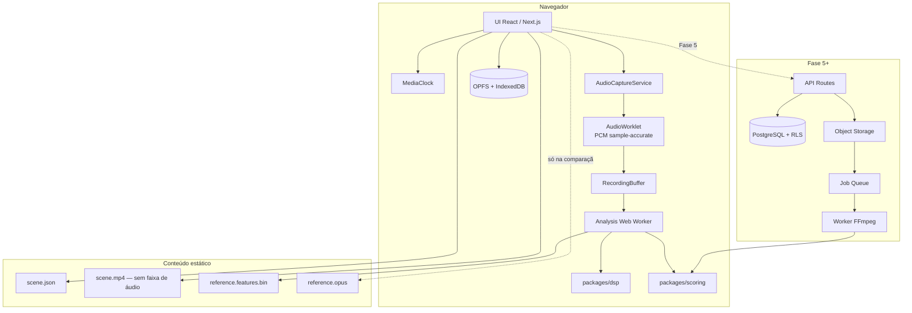
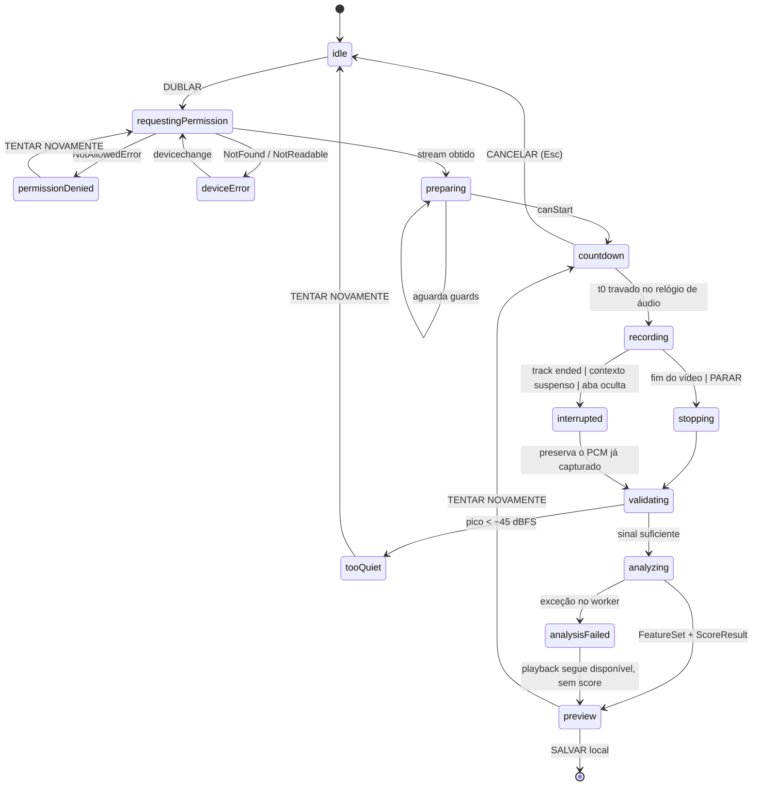

# ARCHITECTURE — Dubla Aí

## 1. Visão geral

Nas Fases 0–4 a aplicação é **local-first**: o catálogo é estático, a gravação e a análise acontecem no
navegador, e nada sai do dispositivo. A arquitetura de servidor está desenhada e o schema escrito, mas
só entra em operação na Fase 5.



Note que `packages/scoring` aparece dos dois lados. É intencional (§2.2).

---

## 2. Pacotes

```
packages/
  config/    presets de eslint, tsconfig e tailwind
  shared/    tipos de domínio, taxonomia de erros, schemas zod, Result<T,E>, logger
  dsp/       STFT, mel, MFCC, CMVN, YIN, RMS, VAD, DTW — puro, zero dependências
  scoring/   ScoreEngine determinístico + config versionada
  audio/     AudioCaptureService, MediaClock, wav encoder, máquina de gravação
  ui/        design system: tokens + componentes
```

### 2.1 Regras de dependência

```
ui      → shared
audio   → shared
scoring → shared, dsp
dsp     → (nada)
web     → todos
```

Proibido: `dsp` e `scoring` **não podem** importar nada de DOM, Node ou React. É o que garante que
rodem igual no navegador, no Web Worker e, na Fase 5, no servidor.

### 2.2 Isomorfia do motor de score

O mesmo código calcula o score no navegador (feedback instantâneo, custo zero) e no servidor (valor
autoritativo, quando existir servidor). Como o engine é **determinístico e sem I/O**, os dois produzem
o mesmo número para a mesma entrada.

Consequência de segurança: o servidor **nunca** confia no score enviado pelo cliente (§78) — ele
recomputa. Como o resultado bate, não há discrepância visível para o usuário. Divergência é logada
como anomalia.

---

## 3. Camada de conteúdo

Uma cena é composta por quatro artefatos separados (§15) — nunca um único MP4:

| Artefato | Conteúdo | Quando é baixado |
|---|---|---|
| `scene.json` | metadados, personagens, segmentos, legendas, direitos | sempre |
| `scene.mp4` | vídeo H.264 720p **sem stream de áudio** | ao abrir a cena |
| `reference.features.bin` | ~40 KB de features pré-computadas | ao iniciar a análise |
| `reference.opus` | áudio de referência | **só** na tela de comparação |

O vídeo não tem faixa de áudio no arquivo. Isso é mais forte que `video.muted = true`: não há como o
áudio original vazar, e nem sequer trafega (§14, §61).

Na Fase 0–4 o catálogo é lido de `content/scenes/*/scene.json` em build time; na Fase 5 vem do
Postgres. O tipo consumido pela UI é o mesmo nos dois casos — `SceneDetail` de `packages/shared`.

---

## 4. Máquina de estados da gravação (§55)

Estados impossíveis são impossíveis por construção: não existem `isRecording`, `isLoading`,
`isStopping` soltos.



### Guards de `preparing → countdown` (§19, §59)

Todos precisam ser verdadeiros:

1. `video.buffered` cobre `[0, min(duration, 10s)]` — o countdown nunca começa para o vídeo travar
   depois (§59);
2. `audioContext.state === 'running'`;
3. o `AudioWorkletNode` está instanciado e reportou o primeiro bloco;
4. existe uma `MediaStreamTrack` de áudio com `readyState === 'live'`;
5. `document.visibilityState === 'visible'`.

### Race conditions do §56 e onde cada uma morre

| Race | Tratamento |
|---|---|
| Clicar gravar duas vezes | `idle` é o único estado que aceita `DUBLAR`; o segundo evento é ignorado pela máquina |
| Parar durante o countdown | `countdown` aceita `CANCELAR` → volta a `idle` e desarma o worklet; nenhuma gravação fica ativa (§103) |
| Sair da página gravando | `beforeunload` + cleanup do efeito param todas as tracks |
| Vídeo termina antes do gravador | `ended` dispara `stopping`; a cauda extra é aparada pelo `mediaStartOffsetMs` |
| Gravador termina antes do vídeo | segmentos sem áudio recebem score 0 com bandeira explícita |
| Microfone desaparece | `track.onended` → `interrupted`, preservando o que já foi capturado |
| Aba pausada | `visibilitychange` + verificação de continuidade de amostras → tentativa marcada suspeita |
| Análise antiga sobrescreve a nova | cada execução carrega um `attemptId`; resultado de `attemptId` obsoleto é descartado |
| Worker duplicado | um worker por tela, `terminate()` antes de recriar |

---

## 5. Threading

| Thread | Responsabilidade |
|---|---|
| Principal | UI, máquina de estados, `MediaClock` |
| Audio worklet | captura PCM, contagem exata de amostras |
| Web Worker de análise | DSP + score (STFT/DTW são pesados demais para o thread principal) |
| rAF | desenho de waveform e espectrograma em Canvas |

Nenhum trabalho de DSP no thread principal. Nenhuma alocação por quadro nos laços de desenho.

---

## 6. Performance (§61)

- A home **não** carrega DSP, worklet, XState nem espectrograma.
- `packages/dsp` e a máquina de gravação entram por `import()` dinâmico na rota da cena.
- Features de referência são binárias (~40 KB), não JSON.
- Canvas com buffer duplo; a waveform estática é desenhada uma vez em canvas offscreen e apenas
  copiada a cada quadro — só o playhead é redesenhado (§69).

---

## 7. Pontos de extensão (o futuro não fica bloqueado)

| Recurso futuro | O que já está no lugar |
|---|---|
| Multipersonagem (§97) | `SpeakerSegment.characterId` existe desde o início; o score já é calculado por segmento |
| Upload e análise no servidor (§26) | engine isomórfico + estados `uploading`/`processing` já modelados |
| Render de vídeo (§37) | `render_jobs` no schema; worker previsto em `apps/worker` |
| Provedor de fala trocável (§27) | `SpeechAnalysisProvider` definido em `shared` como interface; nenhuma implementação hoje |
| Ranking, XP, conquistas (§35) | `analyses` guarda métricas por tentativa; agregações são derivadas |
| Espectrograma ao vivo (§16) | o renderer aceita qualquer matriz tempo×frequência |

Nenhum desses módulos é implementado agora (§96).
