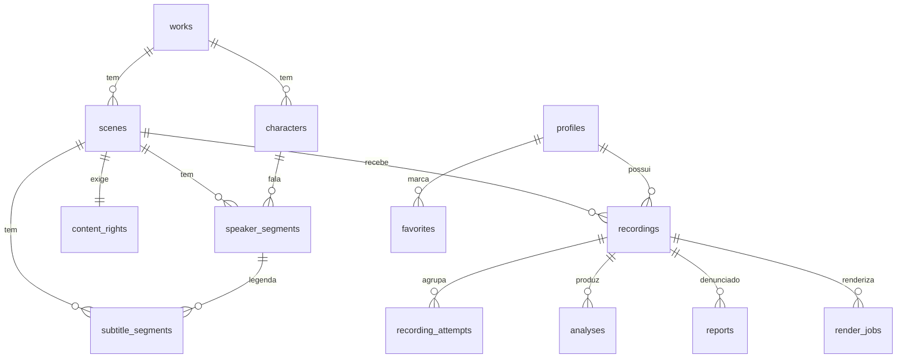

# DATA_MODEL — Dubla Aí

## 1. Um contrato, dois armazenamentos

Os tipos de domínio vivem em `packages/shared/src/domain.ts` e são a **única** definição.

| Fase | Onde os dados moram | Como |
|---|---|---|
| 0–4 (atual) | navegador | catálogo estático em `content/scenes/*/scene.json`; gravações em OPFS; metadados em IndexedDB |
| 5+ | servidor | PostgreSQL (`db/migrations/0001_init.sql`) + Object Storage |

O schema SQL está **escrito e revisado**, mas não aplicado. Os nomes de coluna são `snake_case` e
mapeiam 1:1 para as propriedades `camelCase` dos tipos TS. A migração de local para servidor não muda
nenhum tipo consumido pela UI.

---

## 2. Entidades

### Catálogo

| Tabela | Campos | Notas |
|---|---|---|
| `works` | id, slug, title, type, year, synopsis, poster_key | obra (filme, série, animação, outros) |
| `scenes` | id, slug, work_id, title, description, duration_ms, difficulty, language, video_key, reference_audio_key, features_key, thumbnail_key, character_count, status, created_at, updated_at | `duration_ms ≤ 60000` garantido por CHECK (§9) |
| `characters` | id, work_id, name, color_token, **pattern_token** | `pattern_token` existe porque cor sozinha não pode identificar personagem (§63) |
| `speaker_segments` | id, scene_id, character_id, start_ms, end_ms, text, order_index | quem fala em cada intervalo (§10) |
| `subtitle_segments` | id, scene_id, speaker_segment_id, start_ms, end_ms, text | legenda pode quebrar diferente da fala |

`scenes.status`: `draft · processing · review · published · blocked · expired · archived` (§84).
Apenas `published` aparece publicamente. Mudar para `blocked` é o kill-switch imediato do §39.

### Direitos

| Tabela | Campos |
|---|---|
| `content_rights` | id, scene_id, source, owner, license_type, license_start, license_end, territories[], usage_restrictions, proof_reference, created_at |

Toda cena publicada **precisa** de uma linha aqui — garantido por trigger. Ver `CONTENT_RIGHTS.md`.

### Gravação e análise

| Tabela | Campos | Notas |
|---|---|---|
| `recordings` | id, user_id (nullable), scene_id, mode, storage_key, duration_ms, format, sample_rate, channels, **recording_offset_ms**, **clock_confidence**, **sample_continuity_ok**, visibility, status, created_at, updated_at | `user_id` nulo = gravação anônima (§53) |
| `recording_attempts` | id, recording_id, attempt_number, is_best, created_at | histórico opcional (§34) |
| `analyses` | id, recording_id, **engine_version**, **config_version**, overall_score, sync_score, articulation_score, rhythm_score, pitch_score, energy_score, occupancy_score, confidence, **unavailable_metrics** text[], global_offset_ms, raw_analysis jsonb, created_at | scores `numeric(5,2)` e **nullable** — null significa não calculável (§12) |

Colunas de score são anuláveis de propósito. `NULL` + a entrada correspondente em
`unavailable_metrics` é como o banco representa "Indisponível". Nunca se grava `0` para significar
"não deu para medir".

`recordings.visibility`: `private · unlisted · public · moderation_review · blocked` (§41).
`recordings.status`: `recording · uploading · queued · processing · completed · failed` (§26).

### Social e moderação (criadas vazias, usadas na Fase 5+)

`profiles` · `favorites` · `reports` · `render_jobs`.

---

## 3. Diagrama



---

## 4. RLS (§81)

Aplicada na Fase 5, escrita agora. O princípio: **descobrir um UUID não dá acesso a nada.**

```sql
-- leitura de gravação: dono, ou explicitamente pública
create policy recordings_select on recordings for select
  using (
    (user_id is not null and user_id = auth.uid())
    or visibility = 'public'
  );

-- escrita: só o próprio dono, e nunca pode reatribuir a outro usuário
create policy recordings_insert on recordings for insert
  with check (user_id = auth.uid());

-- análises herdam a visibilidade da gravação
create policy analyses_select on analyses for select
  using (exists (
    select 1 from recordings r
    where r.id = analyses.recording_id
      and ((r.user_id is not null and r.user_id = auth.uid()) or r.visibility = 'public')
  ));
```

O catálogo (`works`, `scenes`, `characters`, segmentos) é legível publicamente **apenas** quando
`scenes.status = 'published'`. `content_rights` **não** é legível pelo cliente em hipótese alguma.

Teste dedicado na Fase 5: o usuário A tenta ler a gravação privada do usuário B pelo UUID e recebe
zero linhas.

---

## 5. Armazenamento de blobs

Nunca no Postgres (§44, §112). O banco guarda apenas chaves:

```
media/scenes/{sceneId}/video.mp4
media/scenes/{sceneId}/reference.opus
media/scenes/{sceneId}/reference.features.bin
media/scenes/{sceneId}/thumb.webp
recordings/{userId|anon}/{recordingId}.wav
renders/{renderJobId}.mp4
```

Nas Fases 0–4 o prefixo `media/` é servido estaticamente de `apps/web/public/media/` e `recordings/`
é OPFS. As chaves são idênticas nos dois mundos, então a Fase 5 troca só o resolvedor.

---

## 6. Persistência local (Fases 0–4)

| Dado | Onde | Por quê |
|---|---|---|
| PCM/WAV da gravação | **OPFS** (`navigator.storage.getDirectory()`) | arquivos de MB; OPFS lida melhor que IndexedDB |
| Metadados de gravação e tentativas | **IndexedDB** (`dublaai/recordings`, `dublaai/attempts`) | consultável, transacional |
| Preferências (dispositivo, modo, calibração) | `localStorage` | pequeno e síncrono |

Fallback quando OPFS não existe (Safari antigo): Blob em IndexedDB, com aviso de limite de espaço.
`QuotaExceededError` é tratado com mensagem clara e opção de apagar gravações antigas — nunca perde a
gravação atual em silêncio (§58).
