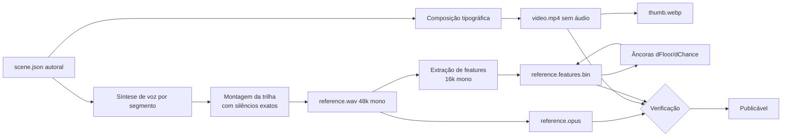

# MEDIA_PIPELINE — Da fonte à cena publicável

## 1. Artefatos de uma cena

Uma cena **nunca** é um único MP4 (§15). São quatro artefatos independentes:

| Artefato | Formato | Tamanho típico (30 s) | Quando chega ao cliente |
|---|---|---|---|
| `video.mp4` | H.264 720p, **sem stream de áudio** | 1,5–4 MB | ao abrir a cena |
| `reference.opus` | Opus 48 kbps mono | ~180 KB | **só** na tela de comparação |
| `reference.features.bin` | binário próprio (`DAF1`) | ~28 KB | ao iniciar a análise |
| `scene.json` | JSON validado por zod | ~4 KB | sempre |

O vídeo não tem faixa de áudio **no arquivo**. Isso é mais forte que `muted`: o áudio original não
pode vazar por manipulação do DOM nem por extensão, e não trafega (§14, §61).

## 2. Pipeline de ingestão



### 2.1 Trilha de referência

Cada `SpeakerSegment` tem `startMs` e `endMs` **autorais**. A síntese produz um WAV por segmento; a
montagem posiciona cada um no seu `startMs` exato dentro de uma trilha silenciosa da duração da cena.

Se a fala sintetizada for mais longa que a janela, o script **ajusta `endMs` no `scene.json`** em vez
de cortar o áudio. Cortar produziria uma referência cujo VAD não bate com os segmentos declarados —
e o score seria medido contra uma mentira.

### 2.2 Vídeo

Composição tipográfica gerada por ffmpeg: cartelas com o nome do personagem, a fala e um indicador de
progresso, com cortes nos limites dos segmentos. 1280×720, 30 fps, `-an` (sem áudio), `yuv420p`,
`+faststart` para começar a tocar antes do download completo.

### 2.3 Features e âncoras de calibração

`reference.features.bin` é produzido pelo **mesmo** `packages/dsp` que roda no navegador. Não existe
implementação paralela — é o que garante que referência e usuário sejam medidos com a mesma régua.

As âncoras de articulação (`SCORING.md` §3.2) são calculadas aqui porque exigem comparar cada cena com
as outras:

- `dFloor` — a referência contra ela mesma com ruído rosa a 20 dB SNR;
- `dChance` — a referência contra as referências das demais cenas.

São gravadas dentro do próprio arquivo de features, então o cliente nunca precisa de outra cena para
pontuar.

## 3. Verificações de publicação

O script falha (exit ≠ 0) se qualquer uma reprovar:

| Verificação | Comando | Motivo |
|---|---|---|
| Vídeo sem áudio | `ffprobe -select_streams a` retorna vazio | §14 — requisito duro |
| Duração ≤ 60 s | `ffprobe` | §9 e CHECK do banco |
| Duração do vídeo ≈ duração da cena | diferença < 100 ms | evita gravação com cauda sem vídeo |
| Segmentos dentro da duração | validação do `scene.json` | evita segmento inalcançável |
| Segmentos sem sobreposição | ordenação + comparação | um falante por vez no MVP |
| VAD da referência bate com os segmentos | onset detectado dentro de ±150 ms do declarado | **a mais importante** — se falhar, o score mede contra dados errados |
| Features íntegras | `frameCount` × tamanho do quadro = tamanho do arquivo | evita binário corrompido |
| Direitos registrados | campo `rights` presente no `scene.json` | §39 |

A penúltima é a que impede a classe de bug mais perigosa do projeto: uma referência cujos tempos
declarados não correspondem ao áudio real produziria scores errados de forma silenciosa e convincente.

## 4. Formato `reference.features.bin`

```
offset  tipo      campo
0       char[4]   magic = "DAF1"
4       uint16    version = 1
6       uint16    flags
8       uint32    sampleRate       (16000)
12      uint16    hopMs            (20)
14      uint16    mfccCount        (13)
16      uint32    frameCount
20      float32   dFloor
24      float32   dChance
28      float32   medianF0Hz
32      uint32    peakCount
36      ...       frames[frameCount]:
                    int8[13]  mfcc      (valor real = v / 8)
                    int16     f0Cents   (-32768 = não sonoro)
                    uint8     voicing   (0..255 = 0..1)
                    int8      rmsDb     (dBFS, saturado em -128)
        ...       peaks[peakCount]: int8 min, int8 max
```

Little-endian. 18 bytes por quadro; 50 quadros/s → **900 B/s**, ~27 KB para 30 s de cena.

## 5. Fase 5+ — o que muda

O mesmo pipeline passa a rodar em `apps/worker` com FFmpeg isolado (`SECURITY.md` §5), acionado por
fila, idempotente por `idempotency_key` (§57). A ingestão passa a ser feita por `/admin` (§83), com os
estados `draft → processing → review → published`.

O render de compartilhamento (§37/§38) — vídeo + voz do usuário, 720p, com overlay opcional — também
vive lá. Nunca no navegador e nunca dentro de um request serverless (§62, §112).
